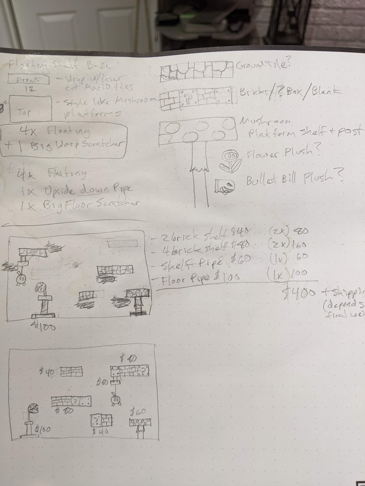
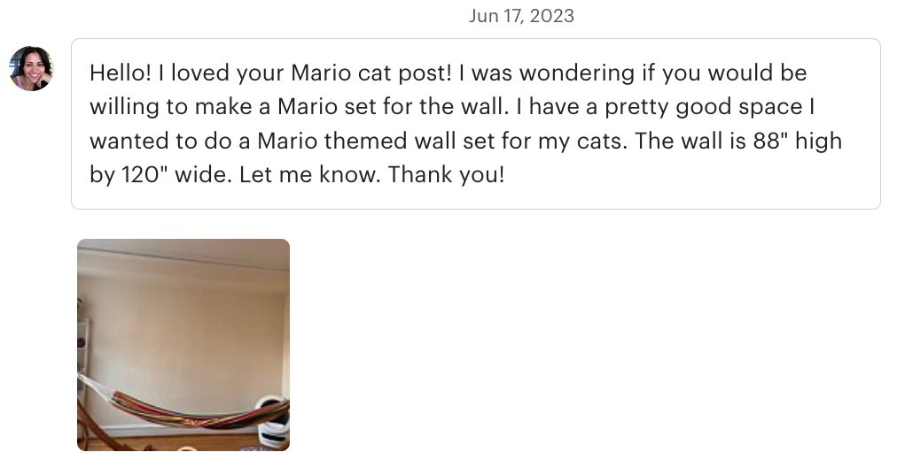
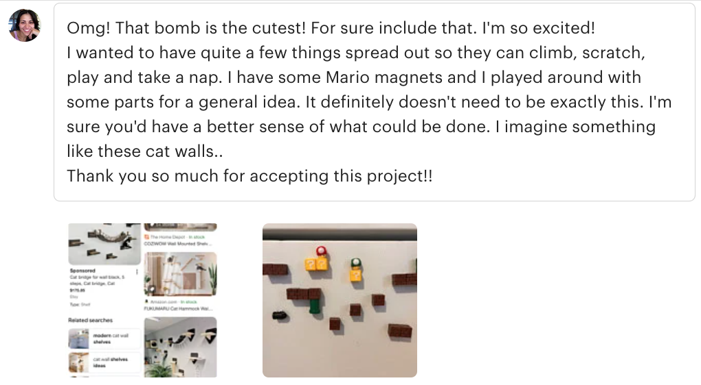
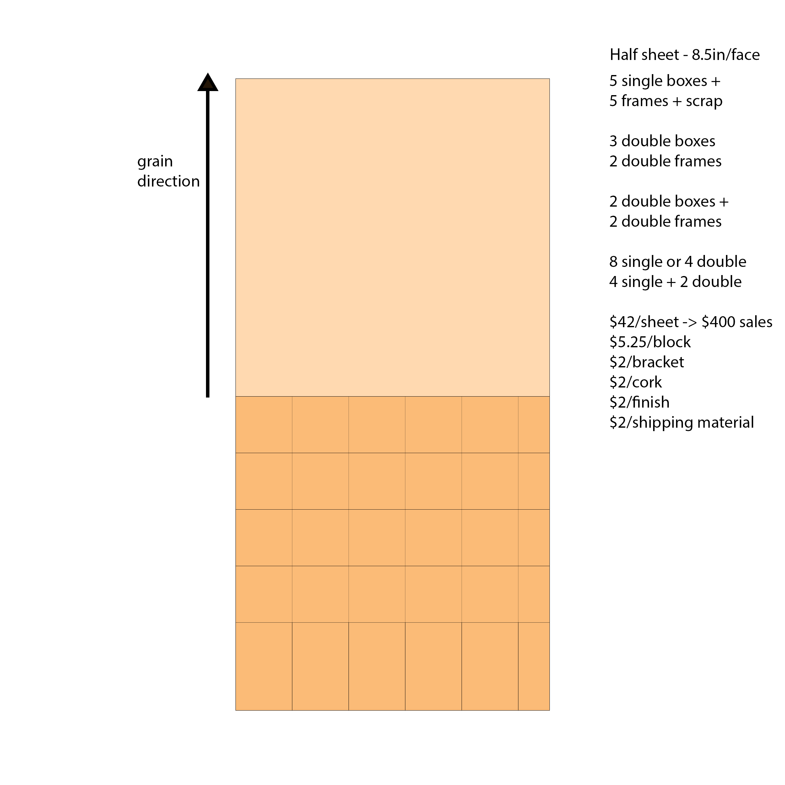

<!--  -->

<!-- # PetArcade: Mario Block Floating Shelf Product -->

>***This Commission Inspired A Whole Product Line***

<!-- #### missing images: (16) #### -->
<!-- - banner (1)
- commission message (1)
- requirements
- DESIGN PROCESS (6)
- limitations (size, weight, which bricks, which game/era)
- materials (3)
- colors (3)
- hardware (1)
- complications (1)
- whats next
- final thoughts -->

### **Tools**
- Boxes.py box maker
- Fusion 360
- Mapboards Pro ***(plugin)***
- Affinity Designer
- Table-saw, router & hand tools
- Glowforge laser

### **Skills**
- 3D Modeling
- Parametric Design
- Kerf-correction
- Color-matching
- Staining & Finishing
- Production Cost Analysis

### **Timeline**

Overall: 8 weeks (June-October, 2023)

Design & Research: 4 weeks

Prototyping: 4 weeks

### **TL;DR**
A stranger emailed me about making a cat wall based on Mario blocks. I accepted the challenge and designed a line of products for my Etsy store based on her commision. I have sold over 30 blocks since launching the products during Black Friday weekend. This is how I did it.
### **Summary**
In the summer of 2023 I ***recieved a message on Etsy from a stranger*** that loved my cat scratchers and wanted to know if I could design a cat wall for her. The answer was an emphatic YES! I already had years of prototypes and sketches of shelf designs and a pile of unused shelf brackets. The aesthetics of invisible floating shelves appeal to me so ***I had a complete vision of how the shelves would work.***

I grabbed my sketchbook and ***revisited my original sketches.*** I applied prototyping and planning skills I learned from previous personal projects. The result was a very rough idea that was good enough to get the greenlight. I ***designed 6 elements*** including my warp pipe scratchers.

<!-- 
***Collage of all aspects of the project.*** -->

### **Problem**
My ***client had an entire wall of her home that she wanted to be covered in these blocks.*** Before I even started designing any parts, I told her that a 6 piece set based on my sketch would ***cost approximately $400.*** but I would do my best to keep the cost down. She was completely unfazed by my estimation that it would also ***take several months*** to complete the project. I couldn't ask for a more accomodating client.
 

With nothing but raw encouragement, and a few sketches, I made a list of design constraints and issues I anticipated. The scope of the project quickly made it clear to me that this would have to be treated like a full product - and possibly an extended line of themed products that I could sell to other people. The client was kept in the loop during the 3 months it took to go from sketch -> 3D model -> prototypes -> final product.

You see, there was no way I was going to put this much effort into a one-off art piece! I've done that before and I learned that art and product are not the same. ***It had to be reproducible and preferably scalable, and easy to modify.*** Essentially, this thing needed to be **printable.** Having the ability to print duplicates at will ensures quicker turn-around and helps minimize costs. With that in mind, I would also ***source as much material as possible locally.***

>Essentially, this thing needed to be **printable.**

#### Constraints: ####
- rigid cube
- lightweight (less than 2 lbs.)
- easy to mount hardware
- supports up to 20 lb. cats
- made from local materials
- costs less than $10 to produce

### **Solution**

The first task was to ***design the classic brick block***, but of course I HAD to make the famous question box too. Otherwise, why even do this? I decided that I would just delete the bricks and add the question marks and rivets when the time comes.

Over the next 2 months I worked on scale model prototypes and material/finish tests in order to perfect the design and work out production details such as:

- optimal dimensions
- best stain/paint/finish combo
- solid wood frame vs. laser cut plywood frame
- finger joint alignment
- flat-pack vs. full assembly

I took care to integrate material, finishing and hardware cost, as well as production lead-time into my decision-making process. My 2 choices at the nearest home store were Maple and Red Oak MDF-core plywood. It's important to note that for lasers, MDF-core plywood cuts much faster, more reliably and cleaner than wood veneer core plywood. 

As we know, a full cube has 6 sides, but with the back side  of the shelf facing the wall, ***I was convinced that I didn't need a back face.*** I could further reduce production time by using an unfinished plywood face for the top, which I planned to cover with 1/4" stablized cork anyway. Eliminating 2 finished faces would dramatically reduce production time and overall cost. 

I mapped a few cutlists in order to maximize the use of a sheet of plywood and came up with a plan that allowed for 10 single blocks. This meant that I can turn a ***$40 sheet of plywood into 10 boxes and frames that could potentially sell for $50-60 each** - Not bad! In reality, there will be some panels that don't make the grade so the yield will be more like 8 complete boxes with a few spares pieces left over.

<!--  -->
***Detailed cutlist showing grain direction of 4x8 sheet***

#### Scale-model Prototype ####
Before I wasted large amounts of pre-finished panels, I worked at 100mm scale and created several prototype faces that I used to test wood finishes and techniques for darkening up the "mortar" lines between the bricks. I used the ingenius Boxes.py website to generate a small finger-joint box that I could quickly print off. I quickly realized some aesthetic issues with my design and 

#### Parametric Design ####
I like using **Fusion360** primarily for its ability to use variables in building **parametric relationships.** This allows you to generate cut files from complex designs at any physical dimension and aspect ratio. **Finger-joints are the go-to method** of building laser-cut boxes and using a handful of tricks I learned how to **generate them algorithmically.** 

At this point I noticed that when you repeat the the brick pattern on every side that it didn't make sense logically. Most examples on the web **lazily repeat the same face** but if you look at the 3D games closely there is a **second pattern** that is revealed on 2 opposing sides. I developed a second algorithm to generate the desired pattern and spacing for the alternate bricks and the requisite centered finger joints. The math is a lot more difficult than it appears at first glance. It gave me some headaches but it forced me to  **learn how to think parametrically** and work smarter in Fusion360.  

The specific end goal is to have a **single parametric design** that can be edited to generate cut files at any scale. The parts **must be repeatable** and be able to adjust designs for materials of varying thicknesses. Hundredths of an inch or millimeter can make or break a **snap-fit finger-joint** project. 

I used boxes.py generated a scale model of shapes2 brick faces that I After a few weeks of prototyping at 1/2 scale I was ready to test my design by changing dimensions. I doubled the x, y, z dimensions from 100mm to the final dimension of 200mm (roughly 8 inches). I was thrilled beyond belief that I had **achieved a file that scaled perfectly!** The key to everything turns out to be basing the entire design entirely out of features rotated and mirrored around the origin and default planes. 

#### Kerf-Correction ####
After achieving **Parametric Nirvana**, the next step was generating cut sheets that automatically account for the width of the laser beam and the space it leaves. There are several ways to do this but the tedious nature of it led me to find a **plugin** that does both operations at once. Figuring out this step helped relieve some anxiety and sped up production by a factor of 3! Shout out to **Mapboards Pro!**

**The Design Process**

***Design process flowchart***

**Project Discovery**

My client wanted me to design a cat-wall for her two cats to play on. She sent several images for inspiration and that was all I needed. I already had sketches for similar idea that had never gotten off the page. 

I shared my old sketches and a few new ideas to fill out the wall. I also shared my cost estimates for each piece and she was all-in. I informed her of several concerns I had before I started working on it.

- be aware that floating shelf hardware requires putting lots of holes in your wall, so make sure you have permission
- requires access and skills to find 

*[ insert client mockup image here]*
<!-- 
**• scheduling process promises "schedule now" but requires way too many clicks**

**• interface is confusing with duplicated information and too much text**

**• showing a full calendar may indicate that your business is too busy for new clients** -->

*[ insert USER JOURNEY image/gallery ]*

Sketches

I began the design process with low-fidelity sketches and wireframes to accelerate decision-making through visualization without losing time. My sketches were based on the initial user interviews, the business goal, and the heuristic evaluation. They each pointed to the fact that there were too many distractions in the flow. We came back to the sketches throughout the entire design process to make sure that we don’t lose sight of our primary goals and ideas.

*[ insert SKETCHES image/gallery ]*

Wireframes

Using Figma, we translated our first sketches into low-fidelity wireframes. Then, we improved them by adding a few relevant stock images and rewrote the copy using ChatGPT. At this stage, the wireframes were defined enough for some user testing. Based on 4 tests, we made a few alternatives and moved on to creating high-fidelity prototypes.

Usability Testing

When we got to usability testing our solution, the project had been to be put on hold. We had no choice but to wrap up this project and move on to the next one. Here are couple of issues that we had plans to address.

**Should the client be scheduled automatically on a "first come, first serve" basis, by phone call, or allow the client to choose?**

We were anxious to test whether clients preferred being scheduled into a consultation slot automatically in the order they apply? Our idea would have A/B tested an automatic scheduling system versus a simulated phone call from a representative. A follow-up survey would have asked about their experience and preference.

Our hypothesis was that a phone call would help build positive rapport, establish a personal connection immediately, and get the client excited to move forward. For the business, it also could serve as a way to eliminate less committed clients that aren't actually ready for the next step.

**Should we prioritize usability for Intentional or for their clients?**

We talked about making a survey for our clients staff to determine where their concerns and preferences lie. **Should scheduling be automatic, or do they see value in the personal touch?**

[ insert **before and after screens**]

UI Design

Once the usability issues were resolved, we moved on to design the final screens in Figma. The goal was to create a simple, inviting, and effective scheduling system that completely matches the current look and feel of the site. The client already has defined style and branding so we really only had to concentrate on the simplifying the layout and process. 

We approach all of our work with a "mobile-first" philosophy. From previous projects, we know that the mobile stats lean highly towards modern iPhones so we keep that in mind at all times.

[ insert figma screens (3)]

Next steps

We were excited to have a crack at redesigning the scheduling process but due to being in the middle of corporate restructuring, the CEO had to decline any further work at the time. She knows the process needs to change is receptive to our findings. She just isn't ready to move forward until 2024. 

**Takeaways**

The main thing we learned is that convincing a company to change their scheduling process is a difficult road. If we continued, we would have liked to do more work with personas and testing. Hopefully we revisit the scheduling process next year, but in the meantime we are happy with our low-tech solution that can be implemented by any front-end developer in minutes. A few notes to consider:

• Clients don't like to change their software, even if they hate the software

• Sometimes the best solutions involve modifying an existing process

• Some clients are impressed by low-tech (low-cost!) solutions

Thanks for reading! 

If you'd like to get in touch contact **jaredtaylor5446@gmail.com**.

***PetArcade is a business that I created for selling hand-crafted amusements for cats AKA "cat toys." I started selling a couple different sisal rope scratchers based on elements from the world of Mario.***

#### If you have read this far and are interested in acquiring some of these shelves, you are in luck! Visit PetArcade on Etsy and use the code MARIOPARTY for 20% off your order. Thanks!

