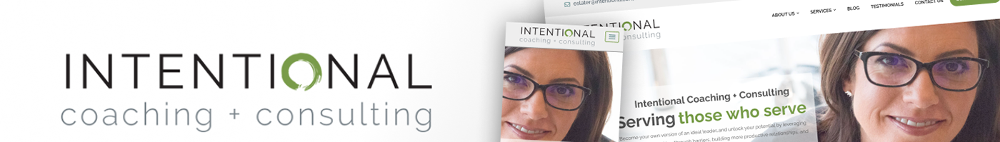
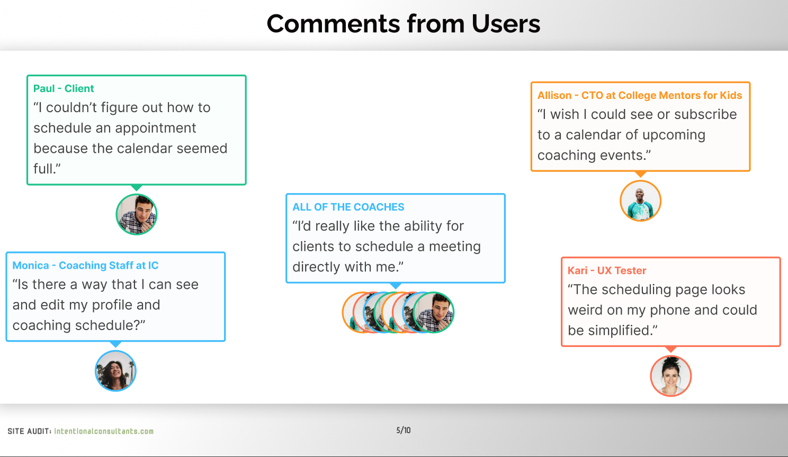

# Intentional Consultants: Website Audit

## Table of contents

## TL;DR

I did an extensive site audit that produced a blueprint for my client to approve and share with their developers. I declined to step on any other devs toes and just provided the suggestions to improve the site for different groups of users. 

### **Tools**

- Figma/Figjam
- Google Docs

### **Timeline**

Overall: 6 weeks (July-October, 2023)

Discovery & Research: 4 weeks

Design: 2 weeks

### **Summary**

After working on several projects for a highly successful business **coaching and consulting business**, the CEO contacted me about evaluating the **scheduling features** on their site. Since there had been **ZERO sign-ups for months**, she was concerned that it was broken.

### **Problem**

During a previous discussion I compiled a list of general notes and suggestions regarding the scheduling feature. The main issue we noticed was that the company's schedule was **booked solid for months**, making it **impossible** for new clients **to schedule a timely consultation**. Furthermore, the feature was confusing, with duplicated information and CTAs that didn't directly do what the label indicated.

### **Solution**

Our initial suggestion was to use a more streamlined and user-friendly scheduling service that would also save them hundreds of dollars a year. Alternatively, we discussed a back-up plan that only required a simple form to collect contact info. While discussing options, the CEO indicated that she was in the middle of reorganizing the corporate structure and **didn't want to change anything** about their internal scheduling any time soon. 

At that point it was clear that the **low-tech solution** was the **superior choice for the client**. It was important not to replace or disrupt their internal scheduling system. **Anticipating the needs of the client paid off** because I already had a basic plan drawn up that could implemented immediately. The solution would be limited to **minor improvements** to their website and workflow. I focused my efforts on a design that **captures contact information** without invoking an automated scheduling service at all. For an added **personal touch**, a designated employee will follow-up with the prospective client directly.

**The Design Process**

*[ insert DESIGN PROCESS image ]*

**Interviews**

During the initial research phase of the project, I was able to reference previous interviews conducted with the CEO and 3 of her coaches, as well as personas that had already been developed.

The main insight gained was that while they were interested in changing their scheduling software in the future, and had many discussions about it, they were wary about changing anything process related. That information allowed me to focus efforts on a low-tech solution that would require minimal changes to their website and workflow.

*[ insert INTERVIEW image here]*

**Surveys**

After the project kickoff, I defined my research strategy and objectives. Understanding the target audience and their challenges were our priority. First, I built an online survey and asked the CEO to forward it to her team and clients. In just a few days, we received 12 submissions. Based on these, I identified 5 common pain points to learn from.

***Everyone indicated that the current scheduling system is flawed.***

Personas

I wanted to form a deeper understanding of our users' goals, needs, experiences, and behaviors. I used 3 personas to represent the users of the site - **administrators, coaches, and clients**. They were based on user interviews and surveys, and I kept updating them throughout the project as more data came in. These personas we used whenever I wanted to step out of myself and reconsider my initial ideas. 

*[ insert PERSONA gallery? 3 images]*

User Journey

First impressions being so important, it's my goal to make sure that clients experience the initial consultation scheduling with minimal friction. To that end, I sketched a current-state user journey map, to focus on opportunities for improvement. I identified 2 unnecessary steps and several potential kinks in the flow. By eliminating these from the new design, we can build a much smoother experience that will increase click-through rates and bring in new business from the website.

**• scheduling process promises "schedule now" but requires way too many clicks**

**• interface is confusing with duplicated information and too much text**

**• showing a full calendar may indicate that your business is too busy for new clients**

*[ insert USER JOURNEY image/gallery ]*

Sketches

I began the design process with low-fidelity sketches and wireframes to accelerate decision-making through visualization without losing time. My sketches were based on the initial user interviews, the business goal, and the heuristic evaluation. They each pointed to the fact that there were too many distractions in the flow. I came back to the sketches throughout the entire design process to make sure not to lose sight of our primary goals and ideas.

*[ insert SKETCHES image/gallery ]*

Wireframes

Working in Figma, I translated my sketches into low-fidelity wireframes. Then, I improved them by adding a few relevant stock images and rewrote some of the copy using ChatGPT. At this stage, the wireframes were defined enough for some user testing. Based on 4 tests, I made a few alternatives and moved on to creating high-fidelity prototypes.

Usability Testing

When it came to usability testing, the project had been to be put on hold. I had no choice but to wrap up this project and move on to the next one. Here are couple of issues that I wanted to address in the future.

**Should the client be scheduled automatically on a "first come, first serve" basis, by phone call, or allow the client to choose?**

I wanted to test whether clients preferred being scheduled into a consultation slot automatically. I would have A/B tested an automatic scheduling system versus a simulated phone call from a representative. A follow-up survey would have asked about their experience and preference.

My hypothesis was that a phone call would help build positive rapport, establish a personal connection immediately, and get the client excited to move forward. For the business, it also could serve as a way to eliminate less committed clients that aren't actually ready for the next step.

**Should we prioritize usability for Intentional or for their clients?**

We talked about making a survey for our clients staff to determine where their concerns and preferences lie. **Should scheduling be automatic, or do they see value in the personal touch?**

[ insert **before and after screens**]

UI Design

Once the usability issues were resolved, we moved on to design the final screens in Figma. The goal was to create a simple, inviting, and effective scheduling system that completely matches the current look and feel of the site. The client already has defined style and branding so we really only had to concentrate on the simplifying the layout and process. 

We approach all of our work with a "mobile-first" philosophy. From previous projects, we know that the mobile stats lean highly towards modern iPhones so we keep that in mind at all times.

[ insert figma screens (3)]

Next steps

We were excited to have a crack at redesigning the scheduling process but due to being in the middle of corporate restructuring, the CEO had to decline any further work at the time. She knows the process needs to change is receptive to our findings. She just isn't ready to move forward until 2024. 

**Takeaways**

The main thing we learned is that convincing a company to change their scheduling process is a difficult road. If we continued, we would have liked to do more work with personas and testing. Hopefully we revisit the scheduling process next year, but in the meantime we are happy with our low-tech solution that can be implemented by any front-end developer in minutes. A few notes to consider:

• Clients don't like to change their software, even if they hate the software

• Sometimes the best solutions involve modifying an existing process

• Some clients are impressed by low-tech (low-cost!) solutions

Thanks for reading! 

If you'd like to get in touch contact **jaredtaylor5446@gmail.com**.
