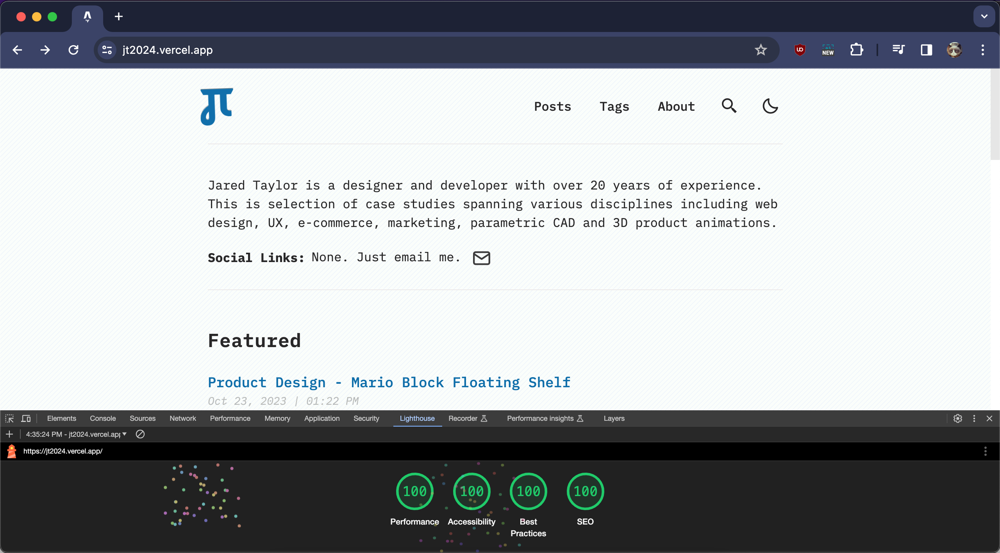

Formally trained as a web designer, career momentum increasingly pushed me into more front-end developer roles, but I have always considered myself a designer that codes by necessity. Getting promoted to "Digital Product Designer" at SDI in 2016 was easily the most rewarding position I have had due to the freedom I was given to explore UI and UX concepts. 

For the last few years I've pursued my interests in designing and making physical products. The case studies presented here show that I'm ready to step into a full-time product design role. I'm always looking for new challenges, so feel free to reach out if you have any questions or want to collaborate.

 
<!-- delete below after placing images -->

 [ image slot ]<!--  -->

## Tech Stack

This site has been updated to <a href="https://astro.build" target="_blank">Astro.js 4.x</a> It has some fancy screen transitions that imitate SPA behavior, while being a static site. It is written in vanilla JavaScript (+ TypeScript for type checking) and a little bit of ReactJS for some basic interactions. TailwindCSS is used for styling; and Markdown is used for blog and page content. The site is fast AF and scores 100s on Google Lighthouse.

<!-- <a href="https://astro.build" target="_blank">Astro.js 4.x</a> -->

## Features:

- fully responsive and accessible
- SEO-friendly
- light & dark mode
- fuzzy search
- super fast performance
- lottie animations
- optimized images
- skinned svg icons